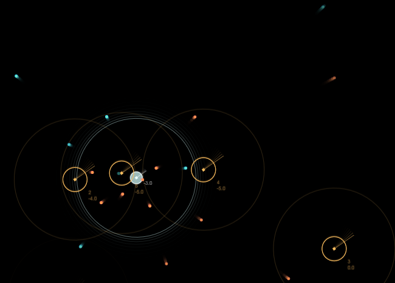

# Vektor-Trek

- [About](#about)
- [Examples](#examples)
- [Features](#features)
- [Limitations](#limitations)
- [How to use](#how-to-use)
- [Concepts](#concepts)
- [Todo](#todo)
- [License »](/LICENSE.md)

 

---

  

## About

Classic arcade style space shooter with Canvas 2D, ES6 and HTML 5.

A 'Proof of concept' and technical experiment about game architecture and math.
Over time the code got a bit messy and it's not intended to sustain ;)

  

## Examples

- [Live demo »](https://christianoellers.github.io/Vector-Trek/)

  

## Features

- Fully playable game with win/lose conditions
- Automatically shoot at stuff (just avoid being hit)
- Bounce into enemy ships rewards with extra score
- Extra speed boost + Fx

  

## Limitations

- Tested with Google Chrome, Desktop only
- Requires keyboard + Mouse to play
- Restart requires page reload

- Playing for longer durations might slow down the game. Projectiles are currently not removed from the scene and will drain performance over time.

  

## How to use

1. Open the 'index.html' in a browser like Google Chrome on any Desktop browser.
2. Read instructions how to play & enjoy!

  

## Concepts

Focusing on just the 'good' parts of the engine, here are a few technical concepts tried out:

- Debug option for renderer and loop to allow progressing frame by frame
  - Also a slow-motion option is available
- 'Plugin style' object configuration for simplicity + consistency
- Decoupled specific object classes to types (as we have no interfaces in JS, that's a quick & dirty workaround)
- Decoupled hardware input from objects by Custom Events
  - This would also simplify testing and remote control (e.g. via UI)
- Multiple collision engines for different purposes (ships, projectile)
- Dynamic animated state switches + animations in some objects

  

## Todo

Fix
- Collision: Vector math sometimes creates extreme values

Optimise
- Remove 'dead objects from scene (projectiles) OR implement an 'object pool'
- OOP
  - Decouple state, view, controls, score ...
  - Decouple constructors from initialisation?

Performance
- HUD + Score should be rendered in HTML, not Canvas
- Use faster sin/cos calculations; e.g. lookup tables or polynomial approximation curves

New features?
- Reacting to score, player could get different weapons or conditional states over time
- Implement 'scene' concept to manage all objects (e.g. pause, show, hide) and switch between multiple scenes

