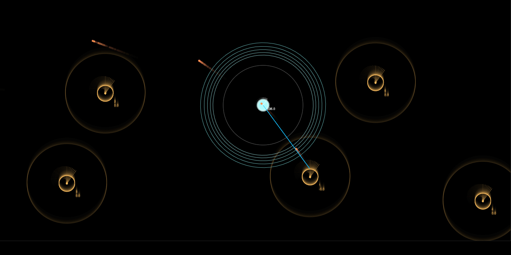

# 2D Arcade space shooter

- [About](#about)
- [Examples](#examples)
- [Features](#features)
- [Limitations](#limitations)
- [How to use](#how-to-use)
- [Todo](#todo)

 

---

 []

  

## About

Classic arcade style space shooter with Canvas 2D, ES6 and HTML 5.

A 'Proof of concept' and technical experiment about game architecture and maths.
Over time the code got a bit messy and it's not intended to sustain ;)

  

## Examples

Find the live version to play here:

- [Play game »](https://christianoellers.github.io/Vector-Storm)

  

## Features

- Fully playable game with win/lose conditions
- Automatically shoot at stuff (just avoid being hit)
- Bounce into enemy ships rewards with extra score
- Extra speed boost + Fx

  

## Limitations

- Tested with Google Chrome, Desktop only
- Requires keyboard + Mouse to play
- Restart requires page reload

- Playing for longer durations might slow down the game. Projectiles are currently not removed from the scene and will drain performance over time.

  

## How to use

1. Open the 'index.html' in a browser like Google Chrome on any Desktop browser.
2. Read instructions how to play & enjoy!

  

## Todo

Fix

- Collision: Vector maths sometimes creates extreme values

Optimize

- Debounce hit testing to prevent fast accumulating scores
- Remove 'dead objects from scene (projectiles) OR implement an 'object pool'
- OOP
  - Decouple state, view, controls, score ...
  - Decouple constructors from initialization?

Performance

- HUD + Score should be rendered in HTML, not Canvas
- Use faster sin/cos calculations; e.g. lookup tables or polynomial approximation curves

New features

- Player should bounce off the boundaries (or slow down) and not be able to leave the field
- Reacting to score, player could get different weapons or conditional states over time
- Implement 'scene' concept to manage all objects (e.g. pause, show, hide) and switch between multiple scenes
